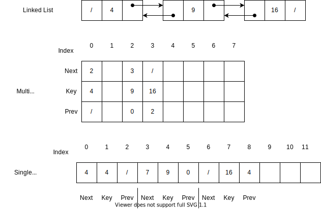

# Pointers

For systems that do not automatically provide pointers, pointers can be created using either a multiple array, or a single array.

Tracking of free space for allocation/de-allocation of elements, can be done by superimposing a second, single linked list which acts as a stack.

