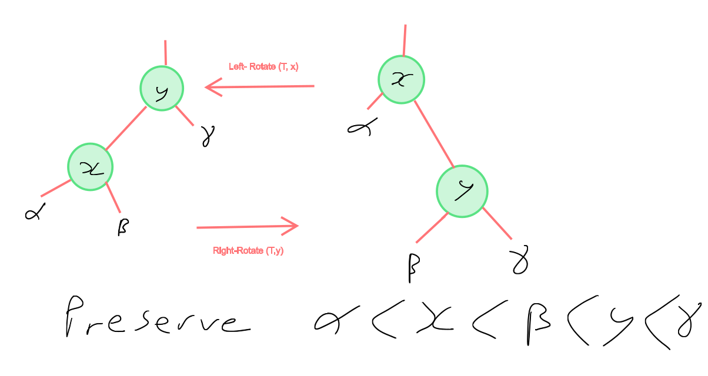
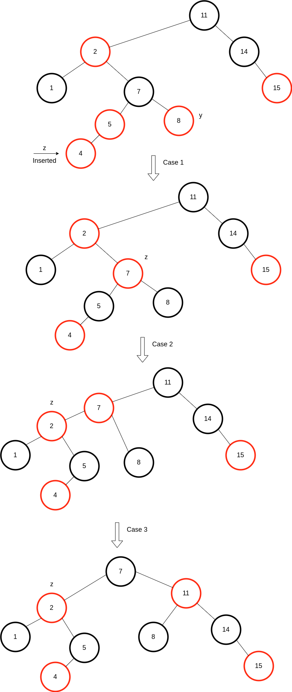

# Binary Trees

A dynamic set, where a balanced tree with n nodes have operations that take $`\Theta \left(\lg n\right)`$.

They can be used both as dictionaries and as priority ques.

They satisfy the property that, for node x in a binary search tree, node y is in the left subtree of x when $`y.key \leq x.key`$, and on the right when $`y.key \geq x.key`$.

An inorder tree walk, prints all the elements in a binary tree, in order $`\Theta \left(n\right)`$.

```
Inorder-Tree-Walk(x)

1: if x != NIL
2:    Inorder-Tree-Walk(x.left)
3:    print x.key
4:    Inorder-Tree-Walk(x.right)

```

# Redblack Tree

Type of self-balancing binary tree. Each node has an associated colour (red or black), to ensure tree remains balanced during insertions and deletions.
When tree is modified the new tree is rearranged and repainted to restore coloring properties.
Rebalancing is not perfect but guarantees searching in O(log n) time. Insertion, deletion, search, re-arrangement and recoloring are also O(log n). Each node requires only one extra bit to store color information.

Properties:
- All nodes are either Red or Black
- All leaf nodes are NIL
- All NIL nodes are considered black
- A red node does not have a red child
- Every path from a given node to a descendant NIL goes through
the same no. of black nodes

## Rotation
Key mechanic in algorithm is rotation of two nodes, while preserving the ordering of the underlying keys.
This is used to re-balance the tree and fix color constraint.

The left rotation pivots left (counter clockwise 90 degrees) around he link, while the right rotation pivots right (clockwise 90 degrees).



## Insertion
Insertion is the same as for a standard binary tree, except that the inserted node is colored red and a fixup function
is called.

### RB-Fixup



Approx pseudo code

```python
def rb_fixup(Tree,z):
    while z.parent.color is red:
        if z.parent == z.parent.parent.left:
            y = z.parent.parent.right
            if y.color is red:              # case 1
                z.parent.color = black      # case 1
                y.color = black             # case 1
                z = z.p.p                   # case 1
            elif z == z.parent.right:
                z = z.parent                # case 2
                Left-Rotate(Tree,z)         # case 2
                z.parent.color = black             # case 3
                z.parent.parent.color = red        # case 3 
                Right-Rotate(Tree,z.parent.parent) # case 3
        else:
            if z.parent == z.parent.parent.right:
                y = z.parent.parent.left
            if y.color is red:
                z.parent.color = black
                y.color = black
                z = z.p.p
            elif z == z.parent.left:
                z = z.parent
                Right-Rotate(Tree,z)
                z.parent.color = black
                z.parent.parent.color = red
                Left-Rotate(Tree,z.parent.parent)

    Tree.root.color = black
```

# AVL vs Red-Black tree
AVL trees are more balanced vs red-black, but use more rotations during insertion and deletion.
Hence for frequent insertions/deletions use Red-black, for more frequent read operations, use AVL.

# Applications
* Self balancing BST such as map and set in C++ (or ordered treeSet and treeMap in Java) use red-black trees.
* Used to implement CPU scheduling in Linux, e.g. Completely fair scheduler uses it.
* Used in K-means clustering algorithm for reducing time complexity
* Used by MySQL for index on tables 

## Build

$ cmake -H. -Bbuild
$ cd build; make
$ ./binarysearchtrees

Or manually using g++
$ g++ --std=c++1z main.cpp