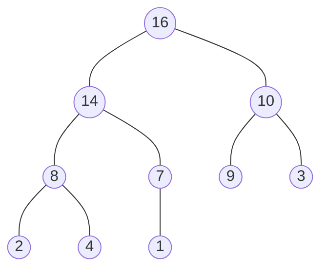
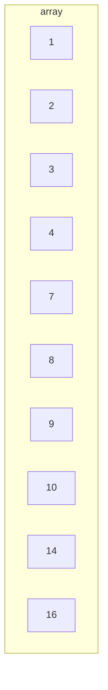

# HeapSort

## Description

An improved version of select sort, dividing its inputs into sorted and unsorted regions.
Like insert sort (but unlike merge sort), heapsort sorts in place.
This way it has the best of both algorithms. Complexity O(nlogn)

Heaps are also an efficient datastructures for priority queues and is used in garbage-collected programming languages.
They are partially filled binary trees, with a max heap having its largest value at the root (top).

This tree has a height of 3 and can be represented as an array:

Accessing adjacent elements can be performed, with

Parent(i) return $`\lfloor i/2 \rfloor`$

Left(i) return $`2i`$

Right(i) return $`2i + 1`$

## Build

$ cmake -H. -Bbuild
$ cd build; make
$ ./mergesort

Or manually using g++
$ g++ --std=c++1z main.cpp