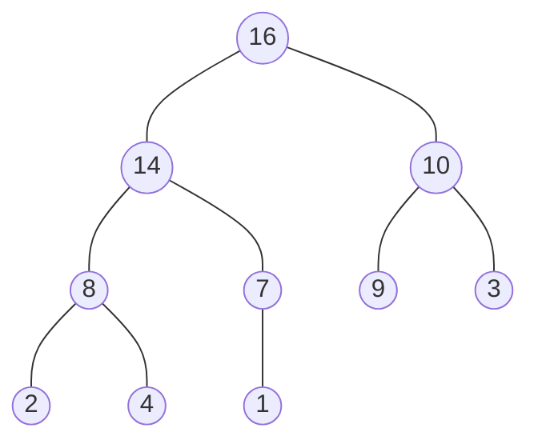
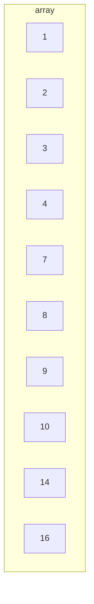

# HeapSort

## Description

An improved version of select sort, dividing its inputs into sorted and unsorted regions.
Like insert sort (but unlike merge sort), heapsort sorts in place.
This way it has the best of both algorithms. Complexity O(nlogn)


Heaps are also an efficient datastructures for priority queues and is used in garbage-collected programming languages.
They are partially filled binary trees, with a max heap having its largest value at the root (top).



This tree has a height of 3 and can be represented as an array:



Accessing adjacent elements can be performed, with

Parent(i) return $`\lfloor (i-1)/2 \rfloor`$

Left(i) return $`2i + 1`$

Right(i) return $`2i + 2`$

Where for a Max-heap $`A \lbrack Parent(i)  \rbrack \geq A \lbrack i \rbrack `$

Seven functions are required for sorting:

* Max-Heapify O(lg n) maintains the max-heap property
* Build-Max-Heap O(n) produces a max-heap from an unordered input array
* Heapsort O(n lg n) sorts an array in place
* Max-Heap-Insert, Heap-Extract-Max, Heap-Increase-Key and Heap-Maxiumum functions  O(lg n) allow the heap datastructures
to implement a priority queue

```python
Max-Heapify(array, i: int = 0, size=None):
    '''
    Ensure that current node at i, is a maximum value with respect
    to its left and right leaf nodes,

    :param array: Array to be sorted
    :param i: Index of node in array
    :param size: Size of the heap to consider. We may want to mask values in the array
    that are larger than the specified size (to perform sorting)
    :return: None - sorts array in place
    '''
   # Set current index to largest by default
    largest = i
    left = 2 * i + 1
    right = 2 * i + 2

   # A size is needed for heapsort (but not building a max heap)
   # Essentially, during the last stages of heapsort, the max (root) element is
   # swapped with the end element, etc
   # When we re-run max-heapify to left the new max float to the top of the array
   # this size parameter, will allow Max-Heapify to ignore the previous max element,
   # stored at the end(s) of the array
    if size is None:
        size = len(array)

    # Compare leaf nodes with current largest index
    if left < size and array[left] > array[i]:
        largest = left

    if right < size and array[right] > array[largest]:
        largest = right

    # If largest is not root
    if largest != i:
        # Swap largest and current root index
        array[largest], array[i] = array[i], array[largest]
        # Ensure that sub tree maintains maxheap via recursive call to 'largest'
        # index (which is no longer largest as we swapped it)
        MaxHeapify(array, largest, size)
```

Max-Heapify assumes that binary trees rooted at Left and Right are max heaps, but that A[i] might be smaller than its children, violating max-heap property. Max-heap lets the value
A[i] float down in the max-heap. The running time is O(h) or
T(n) = O(lg n)

Max-heapify can be used to build a max heap from the bottom up

```
Build-Max-Heap(A):
    for i = A.size()/2 -1 to i = 0:
        Max-Heapify(A,i) 
```

Each call of Max-heap costs O(lg n), and is called n/2 -1 times,
giving O(n lg n).

The heapsort algorithm starts buy using Build-Max-Heap to build a max-heap from an input array

```
HEAPSORT(A):
    Build-Max-Heap(A)
    capacity = A.size()
    for i = A.size() - 1 to 1:
        swap(A[1],A[i])
        capacity = capacity - 1
        Max-Heap(A,1)
```
## Build

$ cmake -H. -Bbuild
$ cd build; make
$ ./heapsort

Or manually using g++
$ g++ --std=c++1z main.cpp